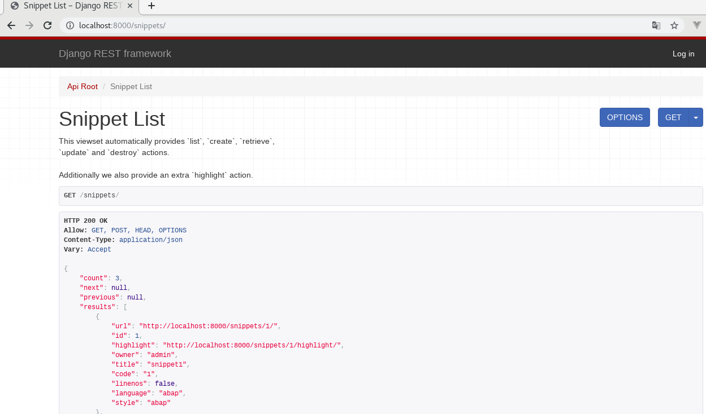
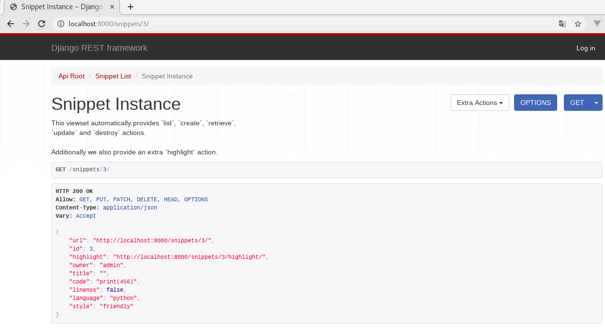
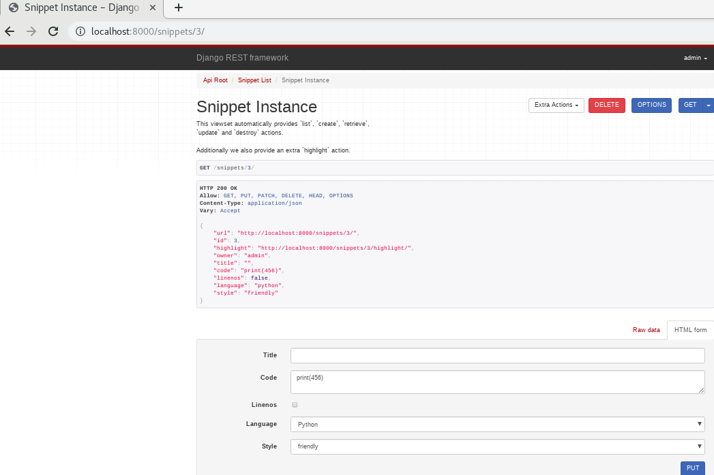

# Django Rest Framework 3 sample
Django Rest Framework 3.9 sample project, with ViewSets, custom permissions and HyperlinkedModelSerializer.

## Table of Contents

* [Instructions](#Instructions)
* [Screenshots](#Screenshots)
* [Testing endpoints](#Testing-endpoints)
    * [Get a list of all of the snippets.](#Get-a-list-of-all-of-the-snippets)
    * [Get a particular snippet by referencing its id.](#Get-a-particular-snippet-by-referencing-its-id)
    * [Post a Snippet.](#Post-a-Snippet)

## Instructions
1. git clone https://github.com/freddiemo/django_rest_framework_3_sample.git
2. virtualenv DRFenv
3. source DRFenv/bin/activate
4. pip install -r requirements.txt
5. create 'django_rest_framework_3_sample' mysql database
6. python manage.py migrate
7. python manage.py createsuperuser --email admin@example.com --username admin
8. python manage.py runserver
9. open in the browser http://localhost:8000
10. open in the browser http://localhost:8000/admin and login with "admin" and and place the password configured in the super admin user created

## Screenshots





## Testing endpoints
### Get a list of all of the snippets.
```javascript
http http://127.0.0.1:8000/snippets/
HTTP/1.1 200 OK
...
[
    {
        "code": "foo = \"bar\"\n",
        "id": 1,
        "language": "python",
        "linenos": false,
        "style": "friendly",
        "title": ""
    },
    {
        "code": "print(\"hello, world\")\n",
        "id": 2,
        "language": "python",
        "linenos": false,
        "style": "friendly",
        "title": ""
    }
]
```
### Get a particular snippet by referencing its id.
```javascript
http http://127.0.0.1:8000/snippets/2/
HTTP/1.1 200 OK
...
{
    "code": "print(\"hello, world\")\n",
    "id": 2,
    "language": "python",
    "linenos": false,
    "style": "friendly",
    "title": ""
}
```
### Post a Snippet.
```javascript
POST using form data.
http --form -a admin:'yourSuperUserPassword' POST http://127.0.0.1:8000/snippets/ code="print(123)"
HTTP/1.1 201 Created
...
{
    "code": "print(123)",
    "id": 4,
    "language": "python",
    "linenos": false,
    "style": "friendly",
    "title": ""
}

```
```javascript
POST using JSON.
http --json -a admin:'yourSuperUserPassword' POST http://127.0.0.1:8000/snippets/ code="print(456)"
HTTP/1.1 201 Created
...
{
    "code": "print(456)",
    "id": 5,
    "language": "python",
    "linenos": false,
    "style": "friendly",
    "title": ""
}

```

